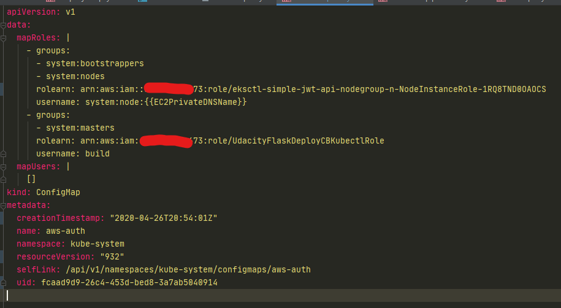
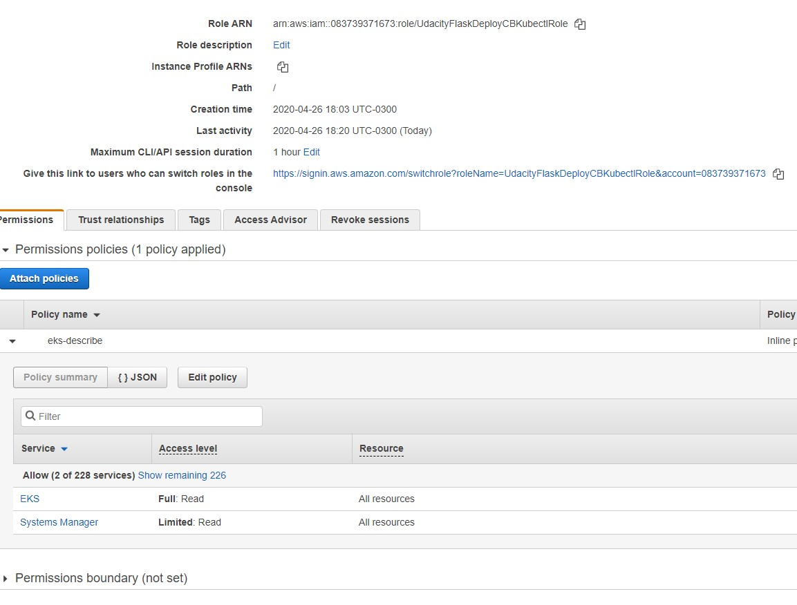
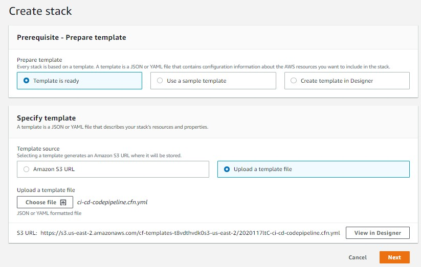
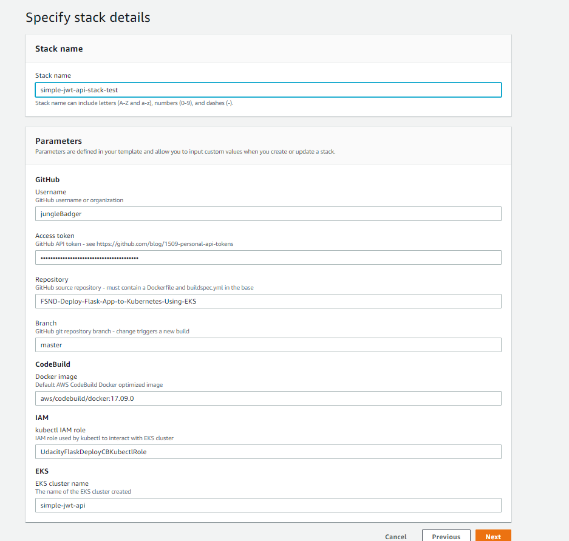
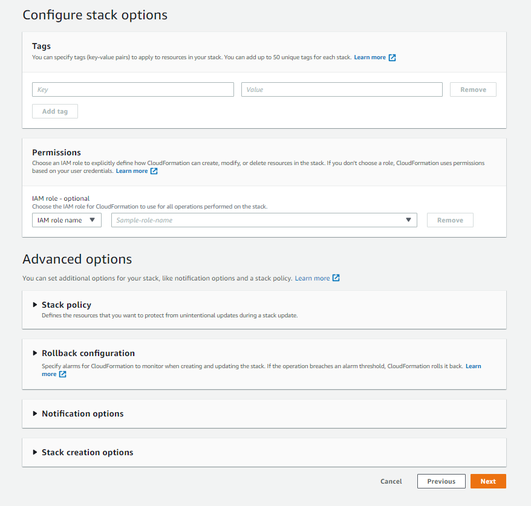
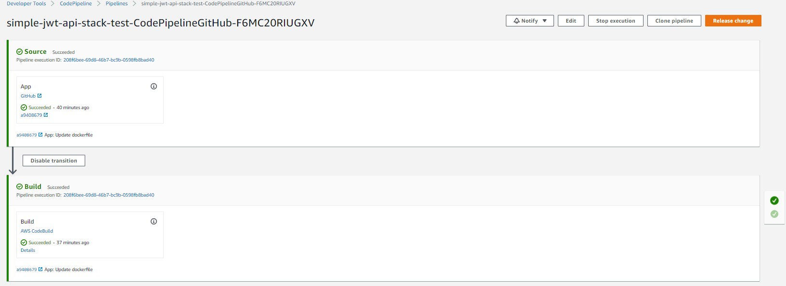

### Dependencies

* AWS Account
* `kubectl` installed
* Bash-enabled terminal (e.g GIT Bash on Windows)


### Step 1 - Login to AWS CLI

The first step consists of [installing](https://docs.aws.amazon.com/cli/latest/userguide/install-cliv2.html) the AWS CLI and [configuring it](https://docs.aws.amazon.com/cli/latest/userguide/cli-chap-configure.html).

```shell script
aws configure
```


### Step 2 - Create EKS Cluster

After setting your context you need to create the services in your account, it is not supposed to serve your web app yet.

You can check the Kubernetes version that was used to create the resources.

```shell script
eksctl create cluster --name simple-jwt-api
```


### Step 3 - Create JWT secret variable

This is the value that will be imported in your pipeline & attached to the running pod. This concept is very important to understand, production apps can't have any credential exposed.

```shell script
aws ssm put-parameter --name JWT_SECRET --value "YourJWTSecret" --type  SecureString
```


### Step 4 - Create an additional role and fetch AWS auth file

This step is very important. An additional role must be created in order to demonstrate the IAM concept and isolation of permissions.

On this step we will create the role and attach `eks` permissions to it and then fetch the AWS auth file, which is responsible for actually configuring it within your account. 

It is important to understand this new role won't have any permissions to it, so in the steps ahead it would fail creating the cluster in the pipeline due to lack of permissions.

PS: One step to notice a difference from the official guide is that we are saving the temporary files in the current directory rather than a temporary folder.

```shell script
ACCOUNT_ID=$(aws sts get-caller-identity --query Account --output text)

TRUST="{ \"Version\": \"2012-10-17\", \"Statement\": [ { \"Effect\": \"Allow\",  \"Principal\": { \"AWS\": \"arn:aws:iam::${ACCOUNT_ID}:root\" }, \"Action\":  \"sts:AssumeRole\" } ] }"

aws iam create-role --role-name UdacityFlaskDeployCBKubectlRole --assume-role-policy-document "$TRUST" --output text --query 'Role.Arn'

echo '{ "Version": "2012-10-17", "Statement": [ { "Effect": "Allow", "Action": [ "eks:Describe*", "ssm:GetParameters" ], "Resource": "*" } ] }' > ./iam-role-policy

aws iam put-role-policy --role-name UdacityFlaskDeployCBKubectlRole --policy-name eks-describe --policy-document file://./iam-role-policy

kubectl get -n kube-system configmap/aws-auth -o yaml > ./aws-auth-patch.yml
```


### Step 5 - Configure the `aws-auth-patch.yml` file with the new role

Here we will actually declare the new Role and patch the configuration back to our account. This step will in fact enable the `UdacityFlaskDeployCBKubectlRole` to perform the operations as expected.

```yaml
apiVersion: v1
data:
  mapRoles: |
    - groups:
      - system:bootstrappers
      - system:nodes
      rolearn: arn:aws:iam::<YOUR_ACCOUNT_ID>:role/<EXISTENT_ROLE_INFORMATION>
      username: system:node:{{EC2PrivateDNSName}}
    - groups:
      - system:masters
      rolearn: arn:aws:iam::<YOUR_ACCOUNT_ID>:role/UdacityFlaskDeployCBKubectlRole
      username: build
  mapUsers: |
    []
kind: ConfigMap
metadata:
  creationTimestamp: "<AUTO_GENERATED_VALUE>"
  name: aws-auth
  namespace: kube-system
  resourceVersion: <AUTO_GENERATED_VALUE>
  selfLink: /api/v1/namespaces/kube-system/configmaps/aws-auth
  uid: <AUTO_GENERATED_VALUE>
```



### Step 6 - Patch the modified `aws-auth-patch.yml`

After applying the changes in the auth file, validate its content through some [YML linter](http://www.yamllint.com/) to make sure its valid and there is no indentation issues.

From that point on it is just a command to patch the file:

```shell script
kubectl patch configmap/aws-auth -n kube-system --patch "$(cat ./aws-auth-patch.yml)"
```





### Step 7 - Create the `CloudFormation` stack

Now the configurations must be sufficient to create & run the [CI/CD stack](https://us-east-2.console.aws.amazon.com/cloudformation/).

#### Start a new stack creation (top right)


#### Use an existent template (your `ci-cd-codepipeline.cfn.yml`) file


#### Review stack metadata & insert your GIT personal token


#### Finish the configuration & create stack

PS: If you have an IAM role available you can select it in the `permissions` dropdown




### Step 8 - Check the `Codepipeline` service

Now you should have everything in place to build & deploy the application through the [pipeline](https://us-east-2.console.aws.amazon.com/codesuite/codepipeline/pipelines?region=us-east-2)

It should run with no issues since the first run, but I faced a situation where the first deploy didn't work, just make sure to force a new run with the `Release changes` button, just to make sure.

 


### Step 9 - Grab the EKS Cluster endpoint URL

You can just fetch the URL with the command below if everything went smooth as expected

```shell script
kubectl get services simple-jwt-api -o wide
```
 


### Step 10 - Test endpoints

You can either test whole endpoints through CLI or at least see the Healthy endpoint on your browser

```shell script
export URL="a403fa53a96514f12948dd65f87550c1-1498351496.us-east-2.elb.amazonaws.com"
export TOKEN=`curl -d '{"email":"test@test.com","password":"test"}' -H "Content-Type: application/json" -X POST $URL/auth  | jq -r '.token'`
curl --request GET $URL:80/contents -H "Authorization: Bearer ${TOKEN}" | jq
```
 


### Common issues

* Syntax error: newline unexpected [Guide to be done]
